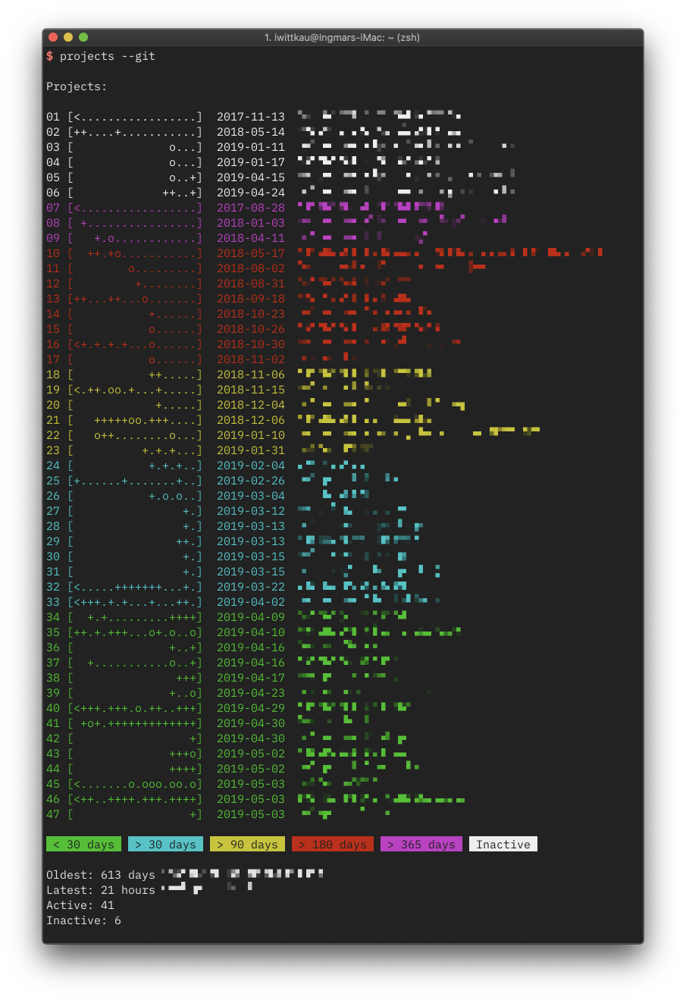

projects
===

> File base projects infos



# Installation

```
go install github.com/iwittkau/projects/cmd/projects
``` 

Create a `.projects` file in your home folder.

Example configuration:

[embedmd]:# (_examples/projects.yaml)
```yaml
workspaces:
- path: /Users/name/projects/project
  name: Name of the Project
  active: true
- path: /Users/name/projects/project-inactive
  name: Name of the Project
  active: false
```

# Usage

```
$ projects --help
Usage of projects:
      --add=false: add current folder to .projects file (currently not working)
      --git=false: analyze git repo commits, falls back to file attributes for non-repository folders
``` 
